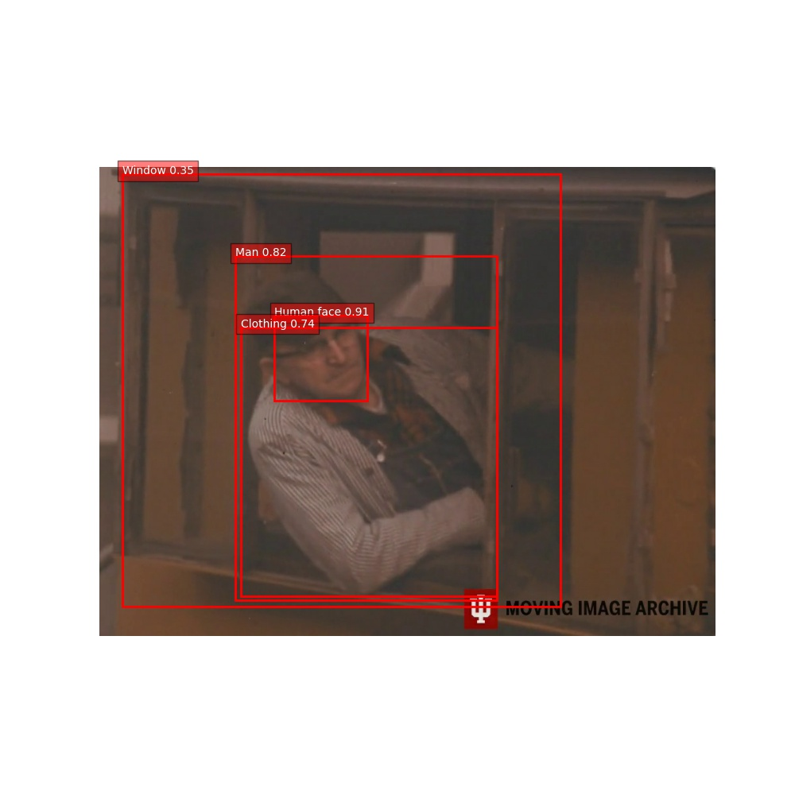
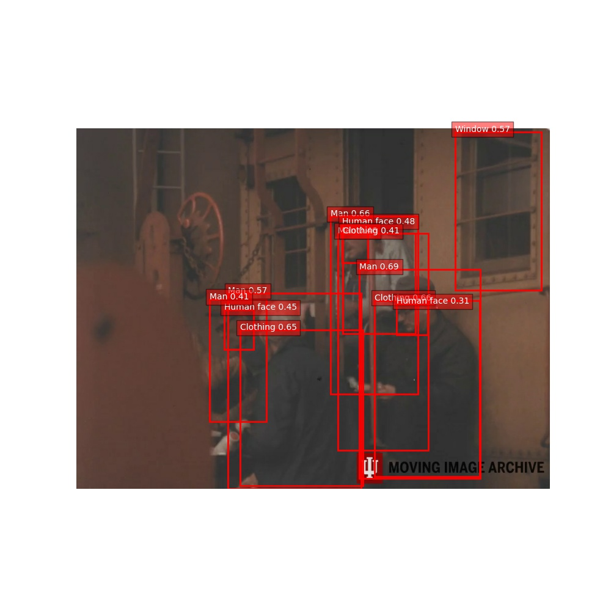
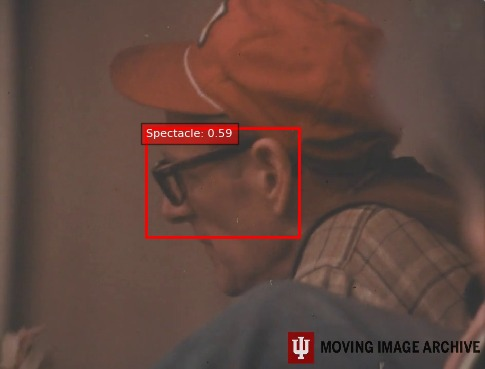
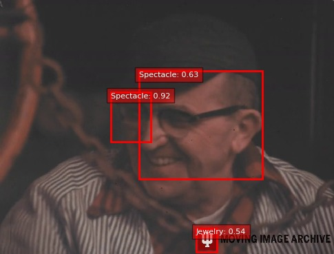
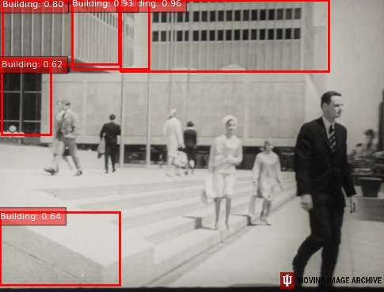
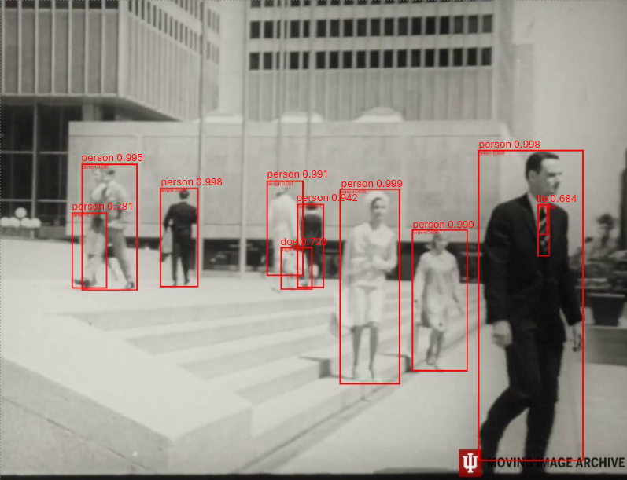

# HistDetect

# Faster RCNN Inception Resnet V2 on Google Open Images Dataset

## Project Description
This project utilizes TensorFlow and TensorFlow Hub to perform object detection on video files. It processes video files to detect objects using the Faster R-CNN model hosted on TensorFlow Hub and outputs detection results in text files.

## Prerequisites
- Python 3.6+
- pip (Python package installer)
- Virtual environment (recommended)

## Environment Setup

Clone the repository and navigate to your project directory:
```bash
git clone https://github.com/maheswar09/HistDetect.git
cd HistDetect
cd FasterRCNN_Inception_ResNet
```

## Creating a Virtual Environment
Creating a virtual environment is recommended to manage dependencies.

**For Unix/macOS:**
```bash
python3 -m venv venv
source venv/bin/activate
```
**For Windows:**
```bash
python -m venv venv
.\venv\Scripts\activate
```
## Installing Dependencies
Install all required packages using pip:
```bash
pip install -r requirements.txt
```
### Set Up TensorFlow Hub Cache
Update the TFHUB cache directory in the Python files before running them:

```python
os.environ['TFHUB_CACHE_DIR'] = '/N/u/naddank/BigRed200/26/tfhub_cache'  # Update the path for the cache file
os.makedirs('/N/u/naddank/BigRed200/26/tfhub_cache', exist_ok=True)  # Ensure the cache directory exists
```
### Main.py

**Description:**
This script takes video input and generates a text file listing detected objects along with their respective frequencies.

**Modifications Required:**

- Update the `video_path` to point to your video file:
  ```python
  video_path = 'vedio_files/xp68m415k-30000157759097_017_mezzCrop-high.mp4'  # Update this path to your video file
  output_base_folder = 'output_texts'  # Update this to your output folder path
  ```
### Running the Application

To run the application after configuring your paths in `Main.py`, execute the following command from your terminal:

```bash
python main.py
```

### Object_detection.py

**Description:**
This script takes a folder of frames extracted from a video and generates images with bounding boxes highlighting detected objects. It is important to run `Frame_extraction.py` before this script to ensure the frames are available for processing.

**Pre-requisites:**
Ensure that the frames have been extracted and are stored in a designated folder.

**Modifications Required:**
- Ensure the path to the folder containing the frames is correctly set in the script.

**Running the Script:**
Update the paths accordingly in the script to point to the folder containing the frames and the output directory where the processed images will be saved.

To run `Object_detection.py`, execute the following command from your terminal:
```bash
python object_detection.py
```
### Results from Main.py

After running `main.py`, the following objects were detected and their counts were recorded:

```yaml
Human face: 25
Clothing: 31
Person: 11
Man: 28
Door: 1
Window: 5
Tree: 2
Building: 2
Land vehicle: 7
Vehicle: 3
Footwear: 3
Train: 4
House: 1
Glasses: 9
Human nose: 2
Poster: 6
Picture frame: 1
Flower: 1
```
### Results from Object_detection.py

After running `object_detection.py`, the following images with detected objects and bounding boxes were generated:




These images show the detected objects with bounding boxes, illustrating the model's ability to identify and localize objects within frames extracted from the video.

# Faster RCNN with resnet50 on Custom Dataset

## Project Description
This project utilizes pytorch to perform object detection on video files. It processes video files to detect objects using the Faster R-CNN model loaded and outputs detection results in text files.

## Prerequisites
- Python 3.10+
- pip (Python package installer)
- Virtual environment (recommended)

## Environment Setup

Clone the repository and navigate to your project directory:
```bash
git clone https://github.com/maheswar09/HistDetect.git
cd HistDetect
cd FasterRCNN_ResNet50_Custom_Classes
```

## Installing Dependencies
Install all required packages using pip:
```bash
pip install torch torchvision
```

### syntheticDataGeneration.py

**Description:**
This script takes the path to the individual classes dataset (where the folder names are the names of the classes), and the number of images to be generated. This generates the composite data (synthetic data) in the folder output_dataset and prints out the number of images used per class in all the composite images generated.

**Pre-requisites:**
Ensure that there is a folder named archive containing the individual dataset classwise

**Modifications Required:**
- Ensure the path to the folder containing the individual dataset is correctly set in the script.

**Running the Script:**
Update the paths accordingly in the script to point to the folder containing the individual dataset.

To run `syntheticDataGeneration.py`, execute the following command from your terminal:
```bash
python syntheticDataGeneration.py
```

### model.py

**Description:**
This script takes the path to the synthetic generated data, downloads the pretrained model to fine tune further, and hence train the model on this custom dataset. It also does evaluation and prints the IOU for each class.

**Pre-requisites:**
Ensure that there is a folder named output_dataset

**Modifications Required:**
- Ensure the path to the folder containing the synthetic data is correctly set in the script

**Running the Script:**
Update the paths accordingly in the script to point to the folder containing the synthetic data. You can also download the synthetic data that we generated using the below drive link:

To run `model.py`, execute the following command from your terminal:
```bash
python model.py
```

### evaluate.py

**Description:**
This script takes the path to the test data, loads the fine tuned model, and hence evaluates the images and saves the images with bounding boxes, along with confidence scores and labels printed on it.

**Pre-requisites:**
Ensure that the training is done using the model.py . This saves the model as model.pth and also ensure there is a folder named test.

**Modifications Required:**
- Ensure the path to the folder containing the test and model.pth is correctly set in the script

**Running the Script:**
Update the paths accordingly in the script to point to the folder containing the test.

To run `evaluate.py`, execute the following command from your terminal:
```bash
python evaluate.py
```

### PipelineToReturnObjectsForVideo.py

**Description:**
This script takes the path to the folder containing the videos and outputs the text document and frames of the video respectively for each video in a separate folder.

**Pre-requisites:**
Ensure that the training is done using the model.py . This saves the model as model.pth

**Modifications Required:**
- Ensure the path to the folder containing the videos and the output base folder, model.pth is correctly set in the script

**Running the Script:**
Update the paths accordingly

To run `PipelineToReturnObjectsForVideo.py`, execute the following command from your terminal:
```bash
python PipelineToReturnObjectsForVideo.py
```

### Precision_Recall.py

**Description:**
This script takes the path to the test folder and the trained model and outputs the precision-recall curve used for further analysis

**Pre-requisites:**
Ensure that the training is done using the model.py . This saves the model as model.pth

**Modifications Required:**
- Ensure the path to the folder containing the test images, model.pth is correctly set in the script

**Running the Script:**
Update the paths accordingly

To run `Precision_Recall.py`, execute the following command from your terminal:
```bash
python Precision_Recall.py
```

### Results

After running `evaluate.py`, the following images with detected objects and bounding boxes were generated:





These images show the detected objects with bounding boxes, illustrating the model's ability to identify and localize objects within frames extracted from the video.

# Faster RCNN with resnet50 on COCO Dataset

## Project Description
This project utilizes pytorch to perform object detection on video files. It processes video files to detect objects using the Faster R-CNN model loaded and outputs detection results in text files.

## Prerequisites
- Python 3.10+
- pip (Python package installer)

## Environment Setup

Clone the repository and navigate to your project directory:
```bash
git clone https://github.com/maheswar09/HistDetect.git
cd HistDetect
cd FasterRCNN_ResNet50_Coco
```

## Installing Dependencies
Install all required packages using pip:
```bash
pip install torch torchvision
```

### FasterRCNN_ResNet50_Coco.ipynb

**Description:**
This script takes the path to the videos folder and the output base folder where the frames are to be saved. It downloads the pretrained model on coco dataset and has all 80 class labels, which are used to convert indexes to class names during prediction

**Running the Script:**
Update the paths accordingly in the script and run the ipynb file from cell to cell

### Results

After running `FasterRCNN_Coco.ipynb`, the following images with detected objects and bounding boxes were generated:



These images show the detected objects with bounding boxes, illustrating the model's ability to identify and localize objects within frames extracted from the video.

